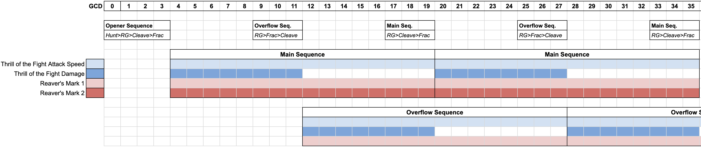

import { Tabs, TabItem } from '@astrojs/starlight/components';
import { Aside } from '@astrojs/starlight/components';

# Aldrachi Reaver Vengeance Demon Hunter Guide

## Core Concepts

The Aldrachi Reaver playstyle revolves around maintaining powerful buffs and debuffs through efficient soul generation and precise execution of Reaver's Glaive (RG) Sequences. Success in this specialization requires carefully planned soul generation, fury management, buff and debuff uptime, target swapping, and cooldown usage within tight buff windows.

<Aside type="tip" title="Key Principles">
- Generate souls as quickly as possible at all times
- Maintain your Thrill of the Fight damage and attack speed buffs
- Maintain two stacks of the Reaver's Mark debuff on your target
- Utilize damage cooldowns during buff windows
- Use The Hunt when Reaver's Glaive is inactive
- Use Cleave RG Sequences in AoE situations (4+ targets)
- In small AOE or Single Target, perform both Fracture and Cleave RG Sequences at the right times
- Only target Reaver's Marked enemies for optimal soul generation
</Aside>

## Key Abilities and Buffs

<Tabs>
  <TabItem label="Thrill of the Fight">
    - Attack speed increase: 20 seconds
    - Damage boost: 10 seconds

    The differing durations create distinct Full and Partial Buff Windows.
  </TabItem>
  <TabItem label="Reaver's Mark">
    - Stackable debuff (up to 2 stacks)
    - Increases target's damage taken by 7% per stack
    - Essential for damage output and soul generation
  </TabItem>
  <TabItem label="Reaver's Glaive">
    - Activated by casting The Hunt or consuming 20 souls
    - Empowers next Fracture and Soul Cleave
    - Triggers application of primary buffs and debuffs
  </TabItem>
</Tabs>

## Reaver's Glaive Sequences

RG Sequences are the cornerstone of the Aldrachi Reaver rotation. Each sequence consists of three primary steps:

1. Cast Reaver's Glaive
2. Cast either Fracture or Soul Cleave
3. Cast the remaining empowered ability

#### Sequence Types

1. **Primary Sequence**: Reaver's Glaive > Soul Cleave > Fracture
   - Generates lower AoE damage
   - Applies two stacks of Reaver's Mark

2. **Overflow Sequence**: Reaver's Glaive > Fracture > Soul Cleave
   - Produces high AoE damage
   - Applies a single stack of Reaver's Mark

<Aside type="caution" title="Fury Management">
Prioritize Immolation Aura and Sigil of Flame, even if it disrupts your RG Sequence. A typical RG Sequence timing is about 3-4 GCDs.
</Aside>

The main idea with these sequences is fairly straightforward:

1. Begin a new primary sequence at the end of the previous primary sequence's buff and debuff window
2. If you can do so while meeting the appropriate conditions, cast an overflow sequence

#### Timing of RG Sequences

It is important to not only time RG Sequences to maximize buff uptime, but also to time them to maximize damage output. You should aim to have your sequences finish in the last second of the previous sequence's buff and debuffs. For example, if you are re-applying Reaver's Mark for a new primary sequence, you should start casting your RG Sequence when your previous Reaver's Mark debuffs will expire right after you finish the re-application sequence.

In short, if your next RG Sequence will take 3 GCDs of time, you should start that sequence when there are 3-4 GCDs worth of time left on the buffs or debuffs. This ensures that your empowered abilities benefit from all the damage increases.

#### Overflow Sequences

Overflow Sequences occur when excess souls are generated beyond Reaver's Mark maintenance requirements. These sequences convert surplus souls into additional damage and buff uptime by casting Reaver's Glaive > Fracture > Cleave for a big burst of damage. These are a very large damage gain if executed well, and a very large damage loss if executed poorly.

Doing this well requires a very strong execution plan. When performing an Overflow Sequence, you should be certain that:
- Your next Primary RG Sequence will not be interrupted
- Your Overflow Sequence will complete in the last second of the previous Full Damage Window
- You will not be interrupted by movement, mechanics, etc.
- You have a fracture charge ready to use
- You have enough fury to execute the Overflow Sequence.

## RG Cycles

After casting an RG sequence you enter a buff window, or RG Cycle, consisting of two phases with different active buff combinations:

1. **Full Buff Window** (0-10 seconds)
   - All buffs active: Thrill of the Fight (Attack Speed and Damage), Reaver's Mark

2. **Partial Buff Window** (10-20 seconds)
   - Active buffs: Thrill of the Fight (Attack Speed), Reaver's Mark

During the Full Buff Window, you are dealing the highest possible damage. This is the time to use your hardest hitting abilities, to line up other damage amplifications (like Fiery Brand or trinkets), and to use potions.

Bear in mind, however, that you still need to be generating souls and spending them before your buff window runs out. This timing is very tight, and you will need to plan your execution carefully.

#### GCD Allocation inside of RG Cycles

An RG Cycle typically spans about 16 GCDs, allocated as follows:

- 3 GCDs: Next Primary (Fracture) RG Sequence
- 2 GCDs: Immolation Aura (x2)
- 2 GCDs: Sigil of Flame (x2)
- 3 GCDs: Overflow (Cleave) RG Sequence
- 6 GCDs: Cooldowns, soul generation, and other abilities

<Aside type="note" title="Optimal Play">
With perfect execution, you can maintain 100% uptime on Thrill of the Fight Attack speed and two Reaver's Mark stacks. You'll have approximately 80% uptime on Thrill of the Fight Damage.
</Aside>

## Soul Generation and Consumption

Efficient soul generation is crucial for maintaining Aldrachi's powerful buffs and debuffs. Each RG Cycle provides limited GCDs for generating souls for the next maintenance sequence. Remember that your top priority is usually generating souls, not spending them.

Ensure you have enough souls to cast the next Primary RG Sequence and Overflow RG Sequence before spending souls or using abilities like Fel Devastation that don't generate souls. This means looking at all of your soul generation cooldowns, The Hunt, etc. and determining the pacing of your upcoming soul generation.

Very frequently you will need to consume souls quickly so that you can use your next Reaver's Glaive at the appropriate timing. This is one of the reasons Spirit Bomb is an essential part of Aldrachi Reaver's toolkit. Consider the following example:

- You have 15 art of the glaive stacks
- You have 6 seconds left on your current buff window
- You have 5 souls currently active

You need to begin your next RG Sequence in about 1.5 seconds, meaning you only have one button press in order to get enough souls to cast the RG Sequence on time. If you use Spirit Bomb, you immediately consume all 5 souls and generate a new Reaver's Glaive, allowing you to cast your RG Sequence on time. If you play without spirit bomb, you will have to cast 3 GCDs worth of Soul Cleave to consume those souls -- your next RG Sequence will be late and it will be un-amplified by the buffs and debuffs.

<Aside type="caution" title="Plan Ahead">
Even if you have sufficient souls for the current moment, think about whether you're going to be entering a period of slow soul generation. If so, you probably want to generate more souls to ensure you have enough to cast the RG Sequence after the one you're about to execute, and so on.
</Aside>

<Aside type="note" title="Soul Overflow">
Soul overflow in Aldrachi is less detrimental than for typical Vengeance gameplay.

Souls that "overflow" while you are capped at max souls still contribute to Art of the Glaive stacks. Your Aldrachi buffs and debuffs are more important to maintain than pressing efficient soul spenders.
</Aside>

#### GCD Management

You'll generally have about 6 GCDs per RG Cycle to use for cooldowns, fury generation, and soul generation. Prioritize soul-generating abilities like Sigil of Spite, Soul Carver, Metamorphosis, and Fracture. Sometimes this priority is unintuitive, like generating souls even when we are at max souls.

While generating souls is important, efficient Fury management is still an essential part of Aldrachi Reaver's rotation. Maintain your fury engine by pressing Sigil of Flame, Immolation Aura, and Fracture as often as possible. Felblade + Unhindered Assault provides a good option for burst Fury generation, should you need it.

<Aside type="note" title="Holding Fracture">
When Metamorphosis is coming off cooldown soon, we want to ensure that we have two charges of fracture ready the moment Metamorphosis is ready to cast. This lets us quickly build souls without needing to wait for Fracture to come off of cooldown.
</Aside>

## Talent Considerations
Because of how important soul generation is, **Sigil of Spite** and **Soul Carver** are very important talents to have.

Conversely, talents related to Fel Devastation (**Darkglare Boon**, **Stoke the Flames**) are fairly weak. This is for many reasons:

1. We cannot take **Collective Anguish** because The Hunt and Sigil of Spite are almost mandatory, weakening Fel Devastation's damage
2. Fel Devastation has to channel for 2 seconds, which is a long time to not be generating or spending souls
3. Fel Devastation has some difficulty finding a good time to be used

## Frequently Asked Questions

No Spirit Bomb Builds

No Spirit Bomb builds are not recommended for Aldrachi Reaver. They are less damage in all scenarios. This is for a few reasons:
1. Spirit Bomb helps consume souls quickly (see section on Soul Generation and Consumption)
2. Spirit Bomb is fire damage and amplified by things like Burning Blood and Fiery Brand
3. Spirit Bomb is uncapped AOE, so will be one of our strongest buttons in large AOE situations
4. Spirit Bomb is a huge burst of healing, which synergizes well with Incorruptible Spirit

Many believe that the "benefit" of dropping Spirit Bomb is a simplified rotation. However, this is actually not true most of the time. Without Spirit Bomb to consume many souls at once, you will likely end up with an even harder rotation. Refer to the image above to see how this can be a problem -- if you have 6 GCDs to generate and consume enough souls, you cannot afford to spend several of them on soul cleave consumption.

